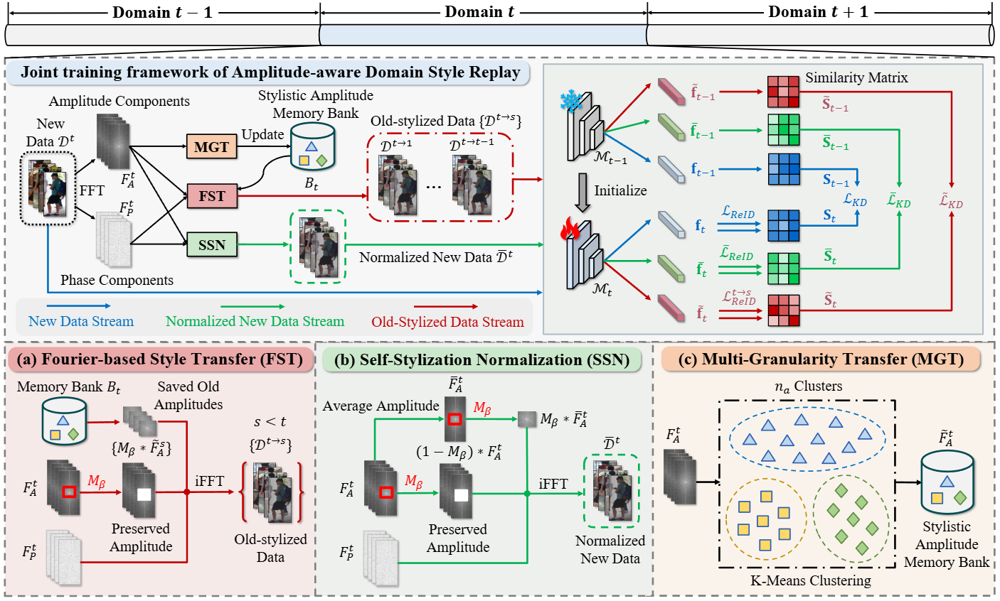

# [ACM MM 2025] Amplitude-aware Domain Style Replay for Lifelong Person Re-identification

The official repository for Amplitude-aware Domain Style Replay for Lifelong Person Re-identification.



## Installation

```shell
conda create -n IRL python=3.7
conda activate IRL
pip install torch==1.13.1+cu117 torchvision==0.14.1+cu117 torchaudio==0.13.1 --extra-index-url https://download.pytorch.org/whl/cu117
pip install -r requirement.txt
python setup.py develop
```

## Prepare Datasets

Download the person re-identification datasets [Market-1501](https://drive.google.com/file/d/0B8-rUzbwVRk0c054eEozWG9COHM/view), [MSMT17](http://www.pkuvmc.com/dataset.html), [CUHK03](https://github.com/zhunzhong07/person-re-ranking/tree/master/evaluation/data/CUHK03), [SenseReID](https://drive.google.com/file/d/0B56OfSrVI8hubVJLTzkwV2VaOWM/view?resourcekey=0-PKtdd5m_Jatmi2n9Kb_gFQ). Other datasets can be prepared following [Torchreid_Datasets_Doc](https://kaiyangzhou.github.io/deep-person-reid/datasets.html) and [light-reid](https://github.com/wangguanan/light-reid).

Then unzip them and rename them under the directory like `/home/Newdisk/username/data`

Move the code under the directory like `/home/Newdisk/username/ADSR`

```
└──data
   ├── cuhk-sysu
   │   └──..
   ├── cuhk01
   │   └──..
   ├── cuhk02
   │   └──..
   ├── cuhk03
   │   └──..
   ├── dukemtmc
   │   └──..
   ├── grid
   │   └──..
   ├── i-LIDS_Pedestrain
   │   └──..
   ├── market1501
   │   └──..
   ├── msmt17
   │   └──..
   ├── prid
   │   └──..
   ├── sense
   │   └──..
   └── viper
       └──..
└──ADSR
   └──..
```

## Quick Start

Training with order-1:
```shell
CUDA_VISIBLE_DEVICES=0 python continual_train.py --logs-dir order1 
```

Training with order-2:

```shell
CUDA_VISIBLE_DEVICES=0 python continual_train.py --setting 2 --logs-dir order2 
```

## Acknowledgement

Our code is based on the PyTorch implementation of [DASK](https://github.com/zhoujiahuan1991/AAAI2025-LReID-DASK) and [LSTKC](https://github.com/zhoujiahuan1991/AAAI2024-LSTKC).

## Contact

Email: long.chen@mail.nwpu.edu.cn

If you have any questions, feel free to communicate with me via my WeChat in the following:


